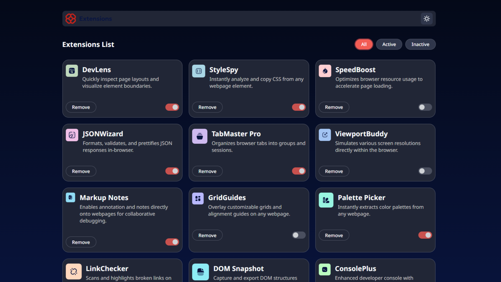

# Frontend Mentor - Solução da interface do gerenciador de extensões do navegador

Esta é a minha solução para o desafio [Browser extensions manager UI
do Frontend Mentor](https://www.frontendmentor.io/challenges/browser-extension-manager-ui-yNZnOfsMAp)

## Sumário

- [Visão geral](#visao-geral)
  - [O desafio](#o-desafio)
  - [Screenshot](screenshot.png)
  - [Links](#links)
- [Meu processo](#meu-processo)
  - [Construído com](#construído-com)
  - [O que aprendi](#o-que-aprendi)
  - [Desenvolvimento contínuo](#desenvolvimento-continuo)
- [Autor](#autor)

## Visão geral

### O desafio

O usuário deve conseguir:

- Alternar extensões entre ativas e inativas
- Filtrar extensões por status (ativas/inativas)
- Remover extensões da lista
- Escolher um tema de cores
- Visualizar o layout ideal para diferentes tamanhos de tela
- Ver os estados de hover e foco em todos os elementos

### Screenshot



### Links

- Solução no Frontend Mentor: [Add solution URL here](https://your-solution-url.com) _em breve_
- Deploy online: [Add live site URL here](https://your-live-site-url.com) _em breve_

## Meu processo

### Construído com

- HTML5 semântico
- CSS (Grid + Flexbox + variáveis personalizadas)
- JavaScript (para as interações dinâmicas)
- Mobile-first workflow

### O que aprendi

Dois pontos foram bem marcantes nesse projeto:

#### Reutilização de elementos com cloneNode()

Durante esse projeto percebi que não é sempre necessário criar grandes strings de template no JavaScript para montar o HTML.
Ao invés disso, usei o método cloneNode(), que me permitiu clonar um elemento pré-existente no DOM e apenas atualizar os valores dinâmicos (como título, descrição, status, etc).

```js
const renderExtension = (extensions) => {
  containerExtensions.innerHTML = "";

  extensions.forEach((extension) => {
    const card = template.content.cloneNode(true);

    const logo = card.querySelector(".card__icon");
    const title = card.querySelector(".extension-card__title");
    const description = card.querySelector(".extension-card__description");
    const toggle = card.querySelector(".toggle-switch__input");

    logo.src = extension.logo;
    title.textContent = extension.name;
    description.textContent = extension.description;
    toggle.checked = extension.isActive;

    toggle.addEventListener("change", () => {
      extension.isActive = toggle.checked;
    });

    containerExtensions.appendChild(card);
  });
};
```

Isso deixou o código muito mais organizado e compacto.

#### Filtro dinâmico de dados com .then()

Também foi muito interessante aprender a trabalhar com dados carregados de forma assíncrona e aplicar filtros dinâmicos logo após o then(). Isso me ajudou a fixar o conceito de promises e manipulação de dados em tempo real.

```js
loadExtensionsData().then((data) => {
  renderExtension(data);

  document.querySelectorAll("[data-filter]").forEach((button) => {
    button.addEventListener("click", () => {
      document
        .querySelectorAll("[data-filter]")
        .forEach((btn) => btn.classList.remove("active"));
      button.classList.add("active");

      const filter = button.getAttribute("data-filter");
      const filteredData = data.filter((ext) => {
        if (filter === "active") return ext.isActive;
        if (filter === "inactive") return !ext.isActive;
        return true;
      });

      renderExtension(filteredData);
    });
  });
});
```

Com isso, aprendi na prática como carregar dados, aplicar filtros dinâmicos e atualizar a interface de forma simples mas eficiente.

### Desenvolvimento contínuo

Quero continuar evoluindo em:

- Melhorar acessibilidade (uso de aria-labels e navegação via teclado)
- Praticar animações em CSS/JS para transições mais suaves
- Evoluir esse projeto para React no futuro

## Autor

- Frontend Mentor - [@jamillyferreira](https://www.frontendmentor.io/profile/jamillyferreira)
- LinkedIn - [@jamillyferreira](https://www.linkedin.com/in/jamillyferreira/)
- GitHub - [jamillyferreira](https://github.com/jamillyferreira)
